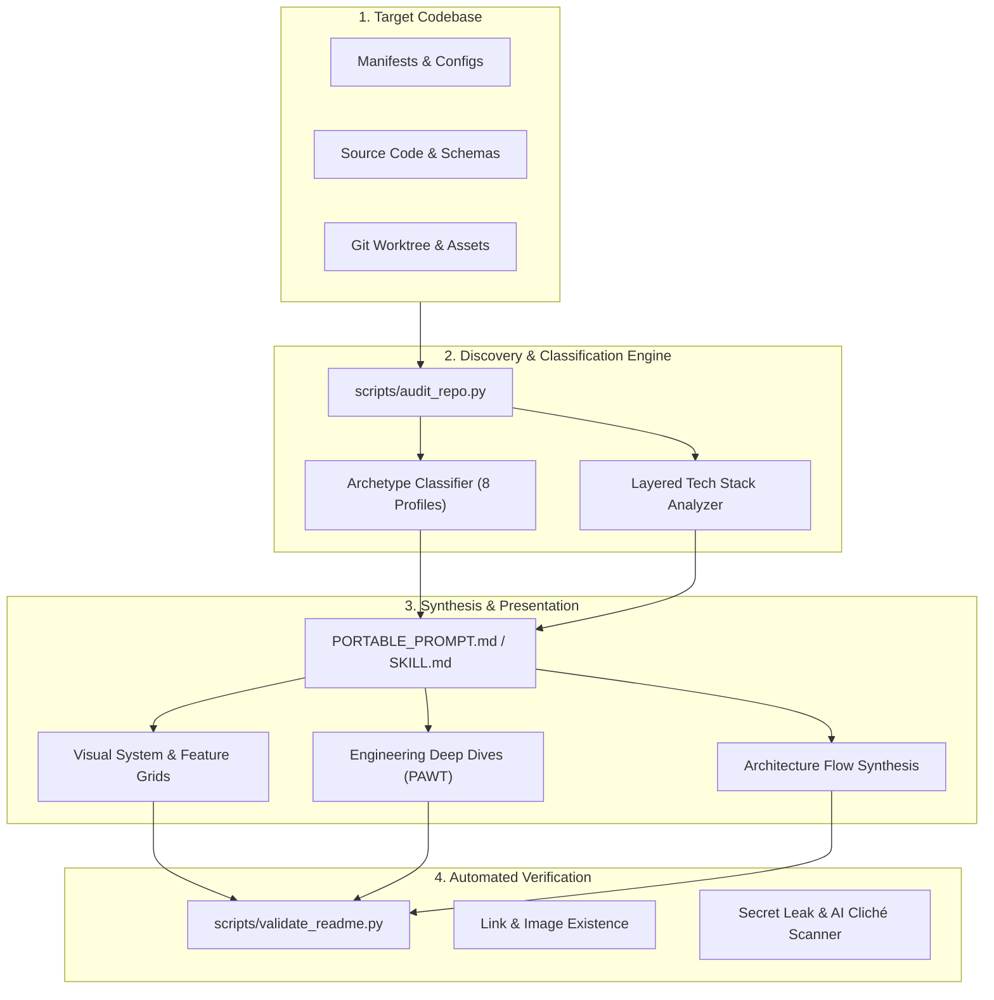

# GitHub Repo Presenter

**A portable, agent-agnostic toolkit for turning unfinished, hackathon, or AI-assisted repositories into elite, portfolio-ready open-source showcases.**

[Portable Playbook](github-repo-presenter/PORTABLE_PROMPT.md) · [Reference Library](github-repo-presenter/references/) · [Audit Tool](github-repo-presenter/scripts/audit_repo.py) · [README Validator](github-repo-presenter/scripts/validate_readme.py) · [Quick Start](#quick-start-for-any-agent-or-ide)

---

## What It Does

`github-repo-presenter` provides the reasoning models, visual structures, and automated verification scripts needed to transform a GitHub repository into an exceptionally polished showcase on par with benchmark projects like **Onlook**, **Twenty**, **Infisical**, **Midday**, and **Browser Use**.

Rather than outputting generic marketing brochureware, it treats the repository as a compact combination of **product page**, **engineering case study**, and **technical documentation**.

### The 10 Visitor Impressions
Whenever this skill is run on a repository, it ensures a technical visitor (recruiter, hiring manager, or engineer) can:
1. Understand what the project does within **~5 seconds**.
2. See why the project is interesting within **~15 seconds**.
3. Visually understand the core product without running it.
4. Understand major capabilities without reading dense text walls.
5. Understand the technical architecture via clear Mermaid flows and module-level walkthroughs.
6. Identify defensible engineering decisions using the **Problem-Approach-Why-Tradeoff** framework.
7. Run the project locally with verified, friction-free setup steps.
8. Navigate the codebase via a curated functional directory tree.
9. Distinguish the project from a generic tutorial or hackathon build.
10. Leave with the impression that the project was intentionally built and maintained.

---

## Architecture & How the Toolkit Works



### End-to-End Execution Protocol
1. **Codebase Deep Dive**: `audit_repo.py` scans manifests, dependencies, API routes, database schemas, Docker files, and tests to ground all claims in source reality.
2. **Archetype Classification**: Classifies the project into one of 8 tailored archetypes (SaaS, AI Agent, Dev Tool, Game, Data/ML, Mobile, Infrastructure, Personal Experimental).
3. **Visual Cadence & Hero**: Formulates a high-impact first viewport, replaces vertical image dumps with structured 2-column feature grids, and standardizes image framing.
4. **Engineering Deep Dives**: Extracts defensible technical hurdles using the **Problem-Approach-Why-Tradeoff** (PAWT) framework.
5. **Automated Validation**: `validate_readme.py` verifies on-disk image existence, relative links, script commands, environment variable parity, and scans for secret leaks or AI marketing fluff.

---

## Supported Project Archetypes

Different software demands different presentation priorities. The toolkit tailors repository structure to:

| Archetype | Presentation Priority | Benchmark Inspiration |
| :--- | :--- | :--- |
| **Product / SaaS** | Product hero, 2x2 visual feature grid, user workflow, client/server/DB architecture | [Twenty](https://github.com/twentyhq/twenty), [Formbricks](https://github.com/formbricks/formbricks) |
| **AI / Agent** | Terminal/browser interaction demo, model/tool orchestration diagram, tool execution loop | [Browser Use](https://github.com/browser-use/browser-use), [Langfuse](https://github.com/langfuse/langfuse) |
| **Developer Tool / Library** | 5-line copy-pasteable code snippet in first viewport, 1-line package install, API ergonomics | [shadcn/ui](https://github.com/shadcn-ui/ui), [Trigger.dev](https://github.com/triggerdotdev/trigger.dev) |
| **Game / Graphics** | Gameplay GIF/video, core loop mechanics, controls table, rendering/physics systems | WebGL / Canvas games |
| **Data / ML** | Problem thesis, pipeline DAG flowchart, dataset provenance, reproducible evaluation commands | Open-source ML pipelines |
| **Mobile Application** | Framed device mockups, user journey, offline storage/sync, Expo/simulator setup | Native & Expo apps |
| **Infrastructure / Backend** | System topology diagram, concurrency/resilience model, wire protocol/API, Docker quickstart | [Infisical](https://github.com/Infisical/infisical), distributed backends |
| **Personal Experimental** | Provocative hypothesis, interactive proof, what was built vs. borrowed, engineering lessons | Novel prototypes & research POCs |

*See [references/project-types.md](github-repo-presenter/references/project-types.md) for full specifications.*

---

## Reference Library

Detailed reference guides are organized in `github-repo-presenter/references/`:

- [**`project-types.md`**](github-repo-presenter/references/project-types.md) — Heuristics, priorities, and section structures for all 8 project archetypes.
- [**`readme-architecture.md`**](github-repo-presenter/references/readme-architecture.md) — Section-by-section information hierarchy, hero rules, scannability, and banned buzzwords.
- [**`visual-system.md`**](github-repo-presenter/references/visual-system.md) — Presentation graphics, 2-column feature grids, aspect ratios, screenshot cropping, and GIF demos.
- [**`engineering-deep-dives.md`**](github-repo-presenter/references/engineering-deep-dives.md) — The Problem-Approach-Why-Tradeoff framework with real codebase examples.
- [**`quality-rubric.md`**](github-repo-presenter/references/quality-rubric.md) — The internal 12-dimension quality scoring rubric (1–5 scale) and refinement triggers.
- [**`benchmark-repos.md`**](github-repo-presenter/references/benchmark-repos.md) — Deep analysis of 10 benchmark open-source repositories.
- [**`github-surfaces.md`**](github-repo-presenter/references/github-surfaces.md) — Repository descriptions, topics, social preview images, and root hygiene.
- [**`agent-conventions.md`**](github-repo-presenter/references/agent-conventions.md) — Supported instruction adapter formats across AI agents and IDEs.

---

## Automated Tooling

The toolkit includes zero-dependency Python utilities (Python 3.10+ standard library only):

### 1. Repository Inventory & Gap Finder (`audit_repo.py`)
Analyzes any target codebase, classifies its archetype, categorizes the tech stack by layer, and reports prioritized gaps:
```bash
python3 github-repo-presenter/scripts/audit_repo.py /path/to/target/project
python3 github-repo-presenter/scripts/audit_repo.py /path/to/target/project --json
```

### 2. Automated README Validator (`validate_readme.py`)
Validates a README for link integrity, image existence on disk, heading hierarchy, script command parity, environment variable matching, and checks for secret leaks or AI clichés:
```bash
python3 github-repo-presenter/scripts/validate_readme.py /path/to/target/README.md
python3 github-repo-presenter/scripts/validate_readme.py /path/to/target/README.md --strict
```

### 3. Instruction Adapter Installer (`install_adapter.py`)
Safely installs instruction adapters into a target repository without overwriting existing files:
```bash
python3 github-repo-presenter/scripts/install_adapter.py --target /path/to/target --adapter agents
```

---

## Quick Start for Any Agent or IDE

Clone the toolkit:
```bash
git clone https://github.com/aiden-guan/github-repo-presenter.git ~/github-repo-presenter
```

### Using in Any Coding Agent (Claude Code, Cursor, Windsurf, Copilot, CLI)
Instruct the agent from inside the project you want to polish:
```text
Read ~/github-repo-presenter/github-repo-presenter/PORTABLE_PROMPT.md and apply it to this repository.
Make evidence-backed changes to transform this codebase into an elite, portfolio-ready showcase.
```

### Codex / Antigravity Skill Install
Install via symlink into your user skills directory:
```bash
mkdir -p ~/.agents/skills
ln -sfn ~/github-repo-presenter/github-repo-presenter ~/.agents/skills/github-repo-presenter
```
Then invoke in your conversation:
```text
$github-repo-presenter Audit this repository and make it portfolio-ready.
```

---

## Non-Negotiable Reality Constraints

1. **Zero Hallucination**: Never invent metrics, users, stars, benchmarks, performance numbers, or features. If unverified, omit or clearly label as unverified.
2. **Zero Fake UI**: Never generate synthetic UI mockups and claim they represent working software. Use Mermaid diagrams or code tables if real captures are unavailable.
3. **Zero Secrets**: Never commit tokens, session IDs, private keys, or passwords.
4. **No Unrelated Rewrites**: Do not refactor functional application logic solely to make the repository look nicer.
