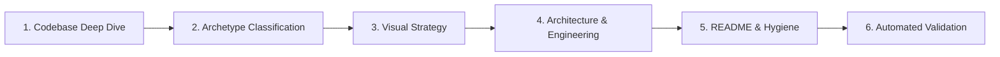

# GitHub Repo Presenter

Transform any project repository into an exceptionally polished, technically credible, visually compelling, and reproducible showcase on par with benchmark open-source projects (**Onlook**, **Twenty**, **Infisical**, **Formbricks**, **Midday**, **Trigger.dev**, **Browser Use**, **Langfuse**, **Plane**, **Excalidraw**).

The resulting repository must feel like a compact combination of **product page**, **engineering case study**, and **technical documentation**—free of generic marketing fluff and empty template boilerplate.

---

## 10 Critical Visitor Goals

A technically sophisticated stranger (engineer, recruiter, or tech lead) must be able to:
1. Understand what the project does within **~5 seconds**.
2. See why the project is interesting within **~15 seconds**.
3. Visually understand the core product without running it.
4. Understand major capabilities without reading dense paragraphs.
5. Understand how the system works technically.
6. Identify the most impressive engineering decisions.
7. Run the project locally with minimal friction.
8. Navigate the codebase easily via an annotated structure.
9. Distinguish the project from a generic hackathon or tutorial build.
10. Leave with the impression that the repository was intentionally designed and maintained.

---

## The Non-Negotiable Grounding Laws (Anti-Hallucination)

> [!CAUTION]
> **Strict Reality Constraint**: Every claim in the repository presentation MUST be grounded in verifiable repository evidence.

- **Never invent** live URLs, metrics, active users, revenue, benchmark numbers, features, integrations, performance speedups, deployment status, awards, or star counts.
- **Label missing evidence** explicitly as missing or unverified. If an API key or remote service is required, say so clearly.
- **Never commit secrets**. Never include real API keys, tokens, session IDs, private keys, or credentials in README or example files.
- **Never generate fake UI screenshots** and present them as proof of working code. If visual assets do not exist, create code-based assets (Mermaid architecture, data flow diagrams, CLI capture scripts) and provide a concrete screenshot capture specification for the user.
- **Never perform broad product rewrites**. Do not alter application logic, refactor packages, or delete features solely to make the presentation look better.

---

## Operational Execution Workflow

Execute the transformation in six disciplined phases:



### Phase 1: Codebase Deep Dive & Grounding
**Never begin by rewriting README.md.** Inspect the repository to understand what was actually built:
1. Run the read-only inventory:
   ```bash
   python3 scripts/audit_repo.py .
   ```
2. Inspect package manifests (`package.json`, `pyproject.toml`, `Cargo.toml`, `go.mod`).
3. Explore key source directories (`src/`, `app/`, `components/`, `lib/`, `server/`, `api/`).
4. Inspect database schemas and migrations (`prisma/`, `drizzle/`, `schema.sql`, `models/`).
5. Check infrastructure and deployment configs (`Dockerfile`, `docker-compose.yml`, `k8s/`, GitHub Actions).
6. Check test suites and seed scripts (`tests/`, `__tests__/`, `scripts/seed.*`).
7. Check existing media assets (`assets/`, `docs/assets/`, `public/`).

From this inspection, deduce:
- Exact primary user outcome and workflow.
- Core differentiating technical mechanism.
- How the application is actually run and verified locally.
- True project maturity (prototype, functional MVP, deployed service).

### Phase 2: Project Archetype Classification
Consult [references/project-types.md](references/project-types.md) and classify the project into its primary archetype:
- **Product / SaaS**: Prioritize product hero, 2x2 visual feature grid, user workflow, client/server/DB architecture, and local vs. deploy paths.
- **AI / Agent**: Prioritize terminal/browser demo, model/tool orchestration diagram, tool execution loop, context management, and honest limitations.
- **Developer Tool / Library**: Prioritize 5-line copy-pasteable code snippet in hero, 1-line package install, API ergonomics, and verified benchmarks.
- **Game / Interactive Graphics**: Prioritize gameplay GIF/video, core loop mechanics, controls table, and rendering/physics architecture.
- **Data / ML**: Prioritize problem statement, pipeline DAG diagram, dataset provenance, and reproducible evaluation commands.
- **Mobile Application**: Prioritize framed device mockups, user journey, offline storage/sync, and Expo/simulator setup.
- **Infrastructure / Backend**: Prioritize system topology diagram, concurrency/resilience model, wire protocol/API, and Docker quickstart.
- **Personal Experimental / Showcase**: Prioritize the provocative hypothesis, proof demo, what was built vs. borrowed, and engineering lessons.

### Phase 3: Visual Presentation Strategy
Consult [references/visual-system.md](references/visual-system.md):
1. **Hero Viewport**: Deliver high-contrast identity, one-sentence value proposition, key links (Demo, Docs, Quickstart), and primary visual proof.
2. **Visual Grids Over Dumps**: Replace vertical screenshot cascades with structured 2-column comparison tables or feature grids (`| Feature A | Feature B |`).
3. **Asset Framing**: Crop away all OS taskbars, browser bookmark bars, and debug tools. Standardize aspect ratios (`16:9` or `4:3`) and ensure 2x retina clarity.
4. **Missing Assets Protocol**: If no UI assets exist, generate a detailed Mermaid system flowchart, create structured code snippet tables, and supply an exact capture specification in the handoff.

### Phase 4: Architecture & Engineering Deep Dives
1. **Architecture Communication**:
   - Construct a clean Mermaid diagram (`flowchart LR` or `flowchart TD`) grouping components into subgraphs (`Client`, `Application Gateway`, `Services`, `Persistence`).
   - Accompany with an end-to-end numbered workflow (steps 1–5) referencing actual source modules.
2. **Interesting Engineering (PAWT Framework)**:
   Consult [references/engineering-deep-dives.md](references/engineering-deep-dives.md). For 1-3 substantial engineering challenges, document:
   - **Problem**: The exact constraint, bottleneck, or concurrency/state hazard.
   - **Approach**: What was implemented in the codebase.
   - **Why**: Why this design was chosen over obvious alternatives.
   - **Tradeoff**: What was sacrificed, complicated, or bounded.

### Phase 5: README Information Architecture & Repository Hygiene
Consult [references/readme-architecture.md](references/readme-architecture.md) and [references/github-surfaces.md](references/github-surfaces.md):
1. Structure the README:
   - Hero (Identity, 1-sentence promise, verifiable badges, hero visual)
   - What it does & why it exists
   - Core capabilities (structured visual grid)
   - Product walkthrough
   - Architecture & system flow (Mermaid + numbered workflow)
   - Interesting engineering (PAWT blocks)
   - Technology stack (categorized by responsibility: Client, Backend, Storage, Infra)
   - Getting started (Prerequisites, Quick Start, Full Dev Setup)
   - Configuration (`.env.example` reference)
   - Curated repository structure (functional tree)
   - Verification & testing commands
   - Roadmap, status & honest limits
   - License
2. Writing Style:
   - Write like a principal systems engineer.
   - Ban all marketing fluff (*revolutionary, cutting-edge, seamless, delve, game-changing*).
   - Use concrete specifics over vague slogans.
3. Clean Repository Root:
   - Remove tracking of generated artifacts (`.DS_Store`, `node_modules/`, build outputs).
   - Verify `.gitignore` covers runtime and build outputs.
   - Ensure a safe `.env.example` exists if environment variables are used.

### Phase 6: Automated Validation & Quality Rubric
1. **Run Automated Validation**:
   ```bash
   python3 scripts/validate_readme.py README.md --strict
   ```
   Ensures all relative links resolve, images exist on disk, heading hierarchy is sound, scripts match `package.json`, environment variables match `.env.example`, and zero secrets or buzzwords exist.
2. **Internal Rubric Self-Check**:
   Consult [references/quality-rubric.md](references/quality-rubric.md). Internally rate the repository on the 12 dimensions:
   1. Clarity
   2. Visual hierarchy
   3. Visual quality
   4. Technical credibility
   5. Technical depth
   6. Demo quality
   7. Architecture communication
   8. Setup quality
   9. Scannability
   10. Repository organization
   11. Accuracy
   12. Originality
   *Trigger Rule: If any dimension scores < 4, perform a targeted revision before completing.* (Never print numerical scores into the README).

---

## Handoff Format

When concluding a presentation pass, provide a crisp 4-part summary:

- **Implemented**: Exact files modified or created and the user-visible presentation enhancements.
- **Locally Verified**: Commands executed and validation tests that passed (e.g., `validate_readme.py`, test commands, link checks).
- **Unverified / Awaiting Owner Action**: External items requiring owner keys, live DNS, deployment triggers, or GitHub remote settings (e.g., repository description, topics, social preview upload).
- **Screenshot / Media Capture Checklist**: If new UI captures are recommended, list exact route, viewport dimensions, interaction state, and destination filename.
