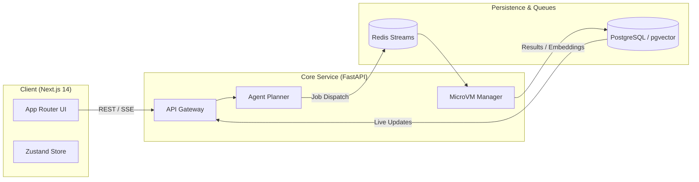

# README Information Architecture & Style Guide

A world-class README is not marketing brochureware, nor is it an unformatted dump of development notes. It is a compact combination of **product page**, **engineering case study**, and **technical documentation**.

This guide defines the information hierarchy, visual cadence, section specifications, and tone required for elite repositories.

---

## The First Viewport Rule

A visitor's eye spends roughly 5 to 15 seconds deciding whether a repository is legitimate. The first viewport must answer:

> **"What is this, why does it matter, and what does it look like in action?"**

It must **never** lead with:
- A wall of 15 shields.io badges
- Raw terminal installation commands before the visitor knows what the software is
- A generic logo centered with 10 empty lines of whitespace
- A verbose 3-paragraph historical motivation essay
- Contributor avatars or sponsor banners

### Anatomy of an Elite Hero Section

```markdown
<div align="center">

# ProjectName

**One crisp, precise sentence stating what the project does and who it is for.**

[Live Demo](https://demo.example.com) · [Documentation](https://docs.example.com) · [Architecture](#architecture) · [Quick Start](#quick-start)

<br/>

[](https://github.com/org/repo/actions)
[](LICENSE)
[](https://github.com/org/repo/releases)

<br/>


</div>
```

*(Note: Center alignment for the hero block is acceptable when kept tight and restrained; left-aligned markdown is equally valid and preferred for developer tools and CLI libraries).*

### Badge Discipline
Badges serve only one purpose: **verifiable status**.
- **Allowed (Max 3-4)**: Build status (CI), Release/Version, License, Core platform/runtime support (e.g., Python 3.10+, Node 20+).
- **Strictly Banned**: Technology logo walls (shields for HTML, CSS, React, JS, Git), visitor counters, social followers, Discord badges unless an active community server is maintained, decorative "Made with love" badges.

---

## Standard Section Hierarchy

For substantial product repositories, follow this sequence:

```text
1. Identity / Hero
2. One-Sentence Value Proposition
3. Primary Action Links (Demo, Docs, Quickstart)
4. Hero Visual or Interactive Demonstration
5. What It Does / Problem Statement
6. Core Capabilities (Structured Visual Grid)
7. Product Walkthrough / User Journey
8. Architecture & System Flow (Mermaid + Numbered Steps)
9. Interesting Engineering (Problem, Approach, Why, Tradeoff)
10. Technology Stack (Organized by Responsibility)
11. Getting Started (Prerequisites, Quick Start, Full Dev Setup)
12. Configuration & Environment Variables (.env.example)
13. Repository Structure (Curated functional tree)
14. Verification & Testing
15. Project Status & Roadmap (Honest boundaries)
16. Contributing & Community Guidelines
17. License
```

*Rule: Include sections only when they add concrete information about this specific codebase. Never include an empty section or boilerplate placeholder.*

---

## Deep Dive: Key Sections

### 1. What It Does (The Value Proposition)
Keep this to 2-3 short, dense sentences. Frame around user or developer outcomes, not framework names.

- **Bad**: *"RepoX is an innovative, cutting-edge, revolutionary AI platform built with Next.js and Supabase that leverages generative AI to transform user experiences."*
- **Good**: *"RepoX is a self-hosted feedback analysis engine that clusters customer bug reports, deduplicates incoming tickets, and generates reproducible GitHub issues directly from production error logs."*

### 2. Core Capabilities (Visual Feature Grid)
Never present capabilities as a vertical stack of 5 full-width screenshots separated by paragraphs. That causes scroll fatigue and looks unedited.

Instead, use a structured 2-column or 3-column table or clean HTML grid:

```markdown
| Automated Deduplication | Root Cause Triage |
| :--- | :--- |
|  |  |
| Embeds incoming stack traces via vector similarity to group identical crashes into a single canonical issue. | Synthesizes git blame and recent PR diffs to point maintainers directly to the introducing commit. |

| Local Sandbox Execution | Real-Time Sync |
| :--- | :--- |
|  |  |
| Runs reproduction scripts inside isolated Firecracker microVMs without exposing host environment credentials. | Pushes triage states and status updates over bi-directional WebSockets with optimistic UI updates. |
```

### 3. Architecture & System Flow
An architecture section builds technical credibility faster than any list of buzzwords.

Always pair a clean Mermaid diagram with a concise **numbered step-by-step workflow** that references actual codebase modules:

```markdown
## Architecture



### End-to-End Execution Flow
1. **Request Intake**: `frontend/src/app/api` forwards user tasks via SSE to FastAPI router (`backend/api/v1/jobs.py`).
2. **Task Planning**: The `AgentPlanner` decomposes the goal into bounded execution steps and writes the initial DAG state to PostgreSQL.
3. **Queue Dispatch**: Worker jobs are pushed to Redis Streams with unique idempotency keys to prevent duplicate execution.
4. **Isolated Execution**: `MicroVMManager` spawns an ephemeral sandbox container, executing arbitrary commands within cgroup memory limits.
5. **Result Aggregation**: Execution logs and diff artifacts are persisted to S3-compatible storage and streamed back to the client UI.
```

### 4. Interesting Engineering Deep-Dives
See [references/engineering-deep-dives.md](engineering-deep-dives.md) for full guidelines.
Always structure each engineering highlight using:
- **Problem**: The exact constraint or challenge.
- **Approach**: What was built to solve it.
- **Why**: Rationale over alternative approaches.
- **Tradeoff**: What was sacrificed or complicated.

### 5. Technology Stack by Responsibility
Do not dump an alphabetized list of 30 libraries. Categorize by architectural layer:

```markdown
## Technology Stack

### Client
- **Framework**: Next.js 14 (App Router, Server Components)
- **Styling**: Tailwind CSS with Radix UI primitives
- **State**: Zustand (optimistic client updates)

### Backend & Orchestration
- **Runtime**: Python 3.11 with FastAPI (async endpoints, SSE streaming)
- **Task Queue**: Redis Streams with custom worker supervisor (`services/worker/`)
- **Isolation**: Docker Engine API with resource-restricted scratch containers

### Persistence & Search
- **Primary Database**: PostgreSQL 16 (relational entities, ACID state)
- **Vector Search**: pgvector extension (cosine similarity on code embeddings)
- **Cache**: Redis 7.2 (session tokens, hot deduplication filters)
```

### 6. Getting Started (Verified & Friction-Free)
Separate **Quick Start** (fastest path to evaluate) from **Full Development Setup** (custom configs, test suites, migrations).

```markdown
## Getting Started

### Prerequisites
- Node.js 20+
- Docker & Docker Compose
- OpenAI API Key (or local Ollama instance)

### Quick Start

1. **Clone the repository**:
   ```bash
   git clone https://github.com/org/repo.git
   cd repo
   ```

2. **Configure environment**:
   ```bash
   cp .env.example .env.local
   # Add your OPENAI_API_KEY to .env.local
   ```

3. **Start local services & app**:
   ```bash
   docker compose up -d db redis
   npm install
   npm run dev
   ```

4. **Verify installation**:
   Open [http://localhost:3000](http://localhost:3000) in your browser.
```

### 7. Curated Repository Structure
Only include directories that explain how the software is organized. Exclude config noise (`.eslintrc`, `.prettierrc`, lockfiles).

```markdown
## Repository Structure

```text
├── src/
│   ├── app/             # Next.js App Router pages and API route handlers
│   ├── components/      # Reusable UI components (primitives and features)
│   ├── core/            # Core business logic and agent planning engine
│   ├── hooks/           # Custom React hooks for client lifecycle
│   ├── lib/             # Third-party wrappers (database client, OpenAI client)
│   └── types/           # Shared TypeScript interfaces and schema types
├── docker/              # Dockerfiles and compose setups for local stack
├── docs/                # Extended architectural documentation and guides
└── tests/               # Unit, integration, and E2E Playwright test suites
```
```

---

## Writing Style & Tone Guidelines

Elite engineering repositories write like senior systems engineers communicating with peers.

### Principles
1. **Be Concise**: Cut every word that does not add technical meaning.
2. **Be Concrete**: Say *"caches responses in Redis with a 60-second TTL"* instead of *"implements sophisticated caching mechanisms"*.
3. **Be Honest**: Say *"Current test suite covers unit logic; integration tests require mock database setup"* instead of claiming *"Enterprise-grade test coverage"*.

### Strictly Banned Clichés & Filler Words
Never use these buzzwords:
- "revolutionary"
- "cutting-edge"
- "game-changing"
- "groundbreaking"
- "seamless / seamlessly"
- "delve / delving"
- "testament to"
- "robust" (unless specifically referring to formal fault-tolerance or type safety)
- "powerful"
- "innovative"
- "blazing fast" (unless accompanied by verified micro-benchmarks)
- "next-generation"
