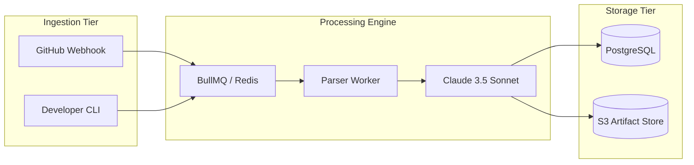

# Visual Presentation System for GitHub Repositories

GitHub READMEs render in browser viewports across dark and light modes, mobile screens, and ultra-wide desktop monitors. A repository's visual assets are the single fastest way to establish professionalism, but poorly formatted, blurry, or gigantic raw screenshots create immediate distrust.

This reference provides concrete rules for capturing, framing, sizing, and laying out visual assets.

---

## Directory Organization for Assets

Keep presentation assets cleanly isolated from application static files:

```text
assets/
└── readme/
    ├── hero.webp          # 16:9 or 2:1 primary hero demonstration or banner
    ├── demo.gif           # 5-15s optimized primary interaction loop
    ├── architecture.svg   # Vector system diagram (or rendered from Mermaid)
    ├── feature-1.webp     # Framed screenshot for capability grid
    ├── feature-2.webp     # Framed screenshot for capability grid
    ├── feature-3.webp     # Framed screenshot for capability grid
    └── feature-4.webp     # Framed screenshot for capability grid
```

*Alternative*: If the repository already uses `docs/assets/` or `.github/assets/`, respect the existing convention. Never dump presentation images into the repository root.

---

## The Rule of Presentation Graphics vs Raw Screenshots

A raw screenshot of an entire browser window—complete with browser bookmarks, OS taskbar, 20 open tabs, battery indicator, and microscopic UI text—signals amateurism.

### Transformation Rules
1. **Crop to the Subject**: Crop out 100% of the operating system chrome, browser toolbar, window borders, and desktop background unless a browser frame is intentionally stylized.
2. **Standardize Aspect Ratios**: All feature screenshots within a grid must share the exact same aspect ratio (e.g., `16:9` or `4:3`).
3. **Capture at 2x Retina Resolution**: Capture screenshots at 2x scale (HiDPI) and downscale in Markdown/HTML using `` or standard markdown links for crisp typography on high-DPI displays.
4. **Remove Ephemeral Debug State**: Hide development banners, React DevTools overlays, `localhost:3000` watermarks, unseeded empty states, or console warnings.
5. **Ensure Legibility at Reading Width**: If text in the screenshot is unreadable when scaled to 800px wide, zoom the browser viewport (125% or 150%) before capturing.

---

## Layout Patterns: Feature Grids vs Vertical Dumps

### Banned Pattern: The Vertical Screenshot Scroll
Never stack 4 or 5 full-width images vertically down the README. A reader will scroll past them without absorbing what they do.

### Recommended Pattern 1: 2-Column Table Grid
GitHub Markdown renders HTML and Markdown tables cleanly. Use a 2-column table where each cell has a title, image, and a concise 2-line explanation:

```markdown
| Real-Time Workflow Monitoring | Automated Anomaly Detection |
| :---: | :---: |
|  |  |
| Live telemetry streaming via WebSockets with sub-100ms update latencies. | Automatic baseline profiling flagging z-score deviations in background workers. |

| Role-Based Access Controls | Audit Log Export |
| :---: | :---: |
|  |  |
| Granular team permission sets with cryptographic session verification. | Structured JSON/CSV export compliant with SOC2 compliance reporting. |
```

### Recommended Pattern 2: Side-by-Side Comparison (Before / After or Split View)
When illustrating a transformation (e.g., raw error log → structured triage output):

```markdown
<div align="center">

| Input: Raw Crash Trace | Output: Structured AI Triage |
| :--- | :--- |
|  |  |

</div>
```

---

## Demonstrations: GIFs, WebMs, and Terminal Recordings

If an application is interactive, a 10-second animation is 10x more convincing than static text.

### The Demonstration Recipe: Input → Interaction → Result
A high-converting demo captures:
1. **Initial state** (clean input form or empty CLI prompt) - 1 second.
2. **User action** (typing command or submitting input) - 2 seconds.
3. **System reaction** (progress spinner, streaming tokens, or processing) - 2 seconds.
4. **Final tangible outcome** (rendered UI, generated file, or completed job) - 5 seconds.

### Tool Recommendations
- **Terminal CLI Tools**: Use [vhs](https://github.com/charmbracelet/vhs) or [asciinema](https://asciinema.org/) to generate crisp, deterministic SVG/GIF terminal recordings with styled fonts and dark themes.
- **Web Applications**: Use clean screen capture tools (CleanShot X, Screen Studio, or Kap) with gentle cursor smoothing and high-quality WebP/GIF compression.
- **File Size Constraint**: Keep all animated GIFs or videos under **5 MB** (ideally under **2.5 MB**). Heavy 25MB GIFs cause repository clone lag and fail to render on mobile GitHub.

---

## Diagrams & System Architecture

GitHub natively renders Mermaid.js diagrams directly in Markdown.

### Guidelines for Professional Mermaid Diagrams
1. **Direction**: Use `flowchart LR` (left-to-right) or `flowchart TD` (top-down) with logical data flow.
2. **Subgraphs as Tiers**: Group nodes into clear subgraphs representing system tiers (`Client`, `Gateway`, `Core Services`, `Data Storage`).
3. **Explicit Node Shapes**: Use distinct node shapes:
   - Rounded rectangles `UI["Dashboard"]` for frontends/services
   - Cylinders `DB[("Postgres DB")]` for storage/databases
   - Hexagons or diamonds for decision engines or queues
4. **Clean Labels**: Never let edges overlap arbitrarily. Keep link labels short (`REST`, `gRPC`, `pub/sub`).
5. **Neutral Theme Styling**: GitHub automatically styles Mermaid according to the viewer's light or dark mode. Avoid hardcoded hex colors that break dark mode readability.

Example:


---

## Dark Mode and Light Mode Compatibility

GitHub allows dark/light mode asset switching using the `#gh-light-mode-only` and `#gh-dark-mode-only` URL fragments on images:

```markdown
<picture>
  <source media="(prefers-color-scheme: dark)" srcset="assets/readme/hero-dark.webp">
  <source media="(prefers-color-scheme: light)" srcset="assets/readme/hero-light.webp">
  
</picture>
```

When creating SVGs (logos, architecture diagrams):
- Use transparent backgrounds (`background: transparent`).
- Use CSS variables or neutral strokes that remain visible on both `#0d1117` (GitHub dark) and `#ffffff` (GitHub light), or provide dual assets using `<picture>`.

---

## Missing Asset Protocol

If the repository does NOT yet have visual assets:
1. **Never invent or synthesize a fake UI** that misrepresents working features.
2. **Create code-based visual assets**:
   - High-fidelity Mermaid architecture diagram
   - High-fidelity Mermaid sequence diagram of the core execution loop
   - Compact annotated directory tree
   - Structured before/after code snippet tables
3. **Specify the exact capture checklist in the handoff**:
   - Provide a precise list of screenshots needed: target route, required viewport dimensions, actions to execute, and filename destination (e.g., *"Capture `localhost:3000/pipelines` at 1920x1080 showing 2 completed runs, save to `assets/readme/feature-pipeline.webp`"*).
